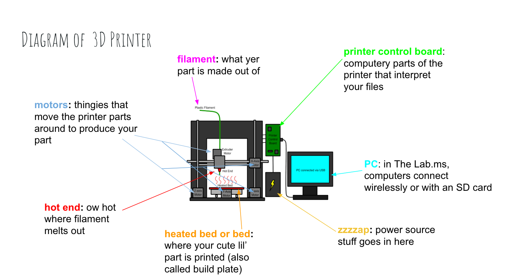
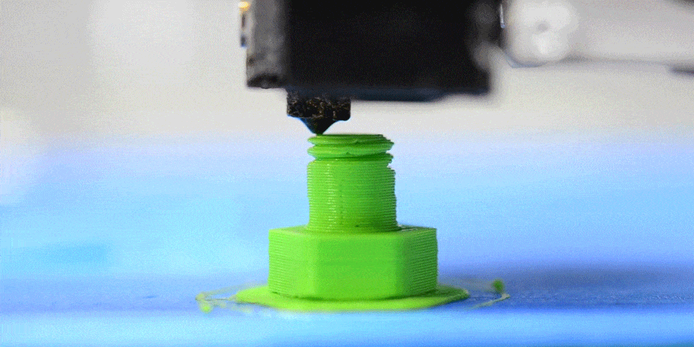
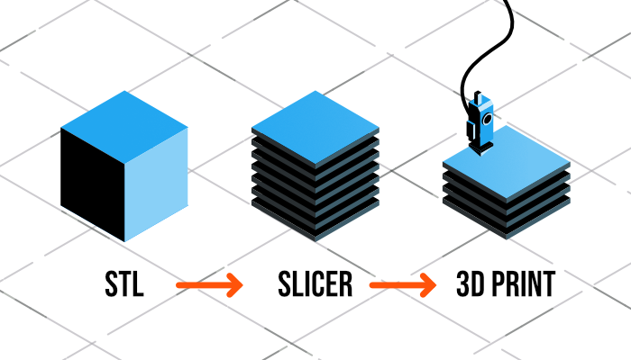
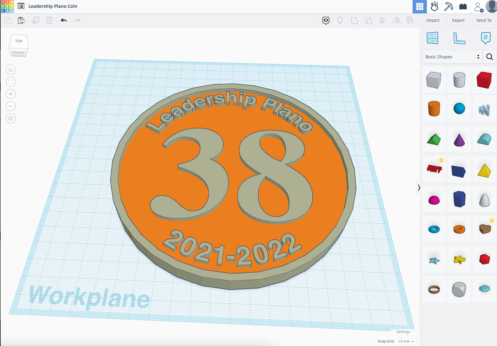
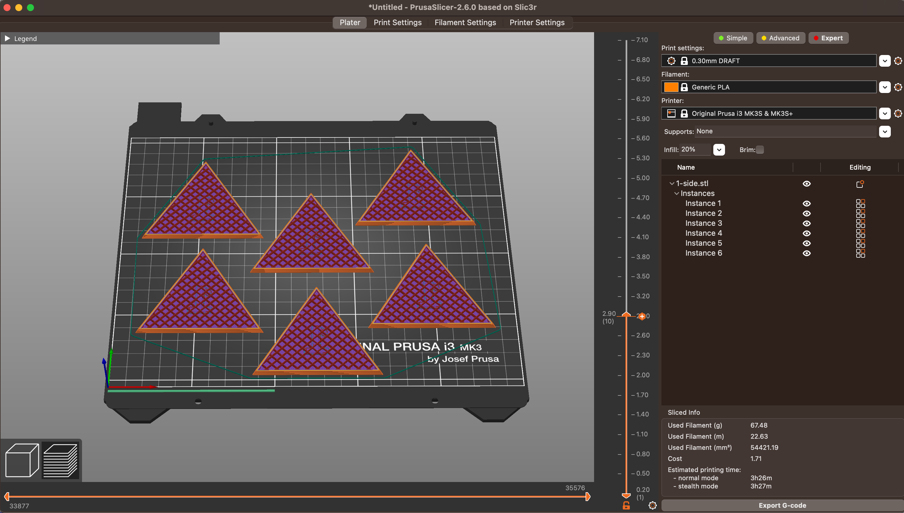
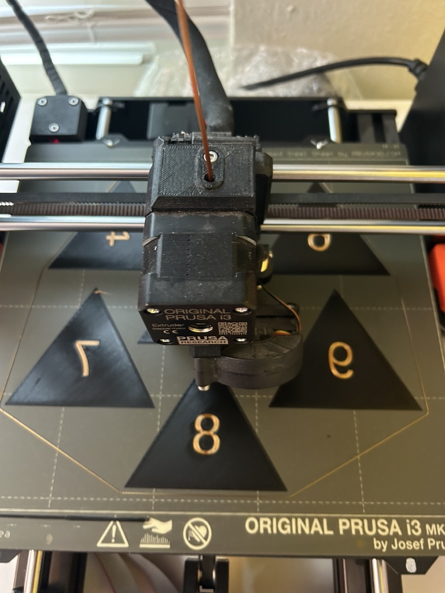
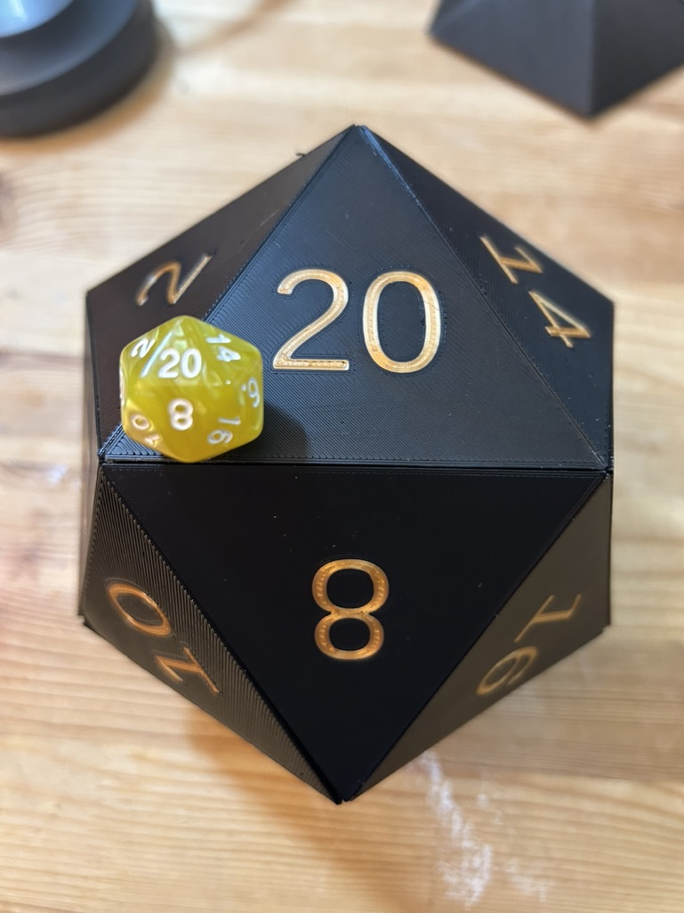
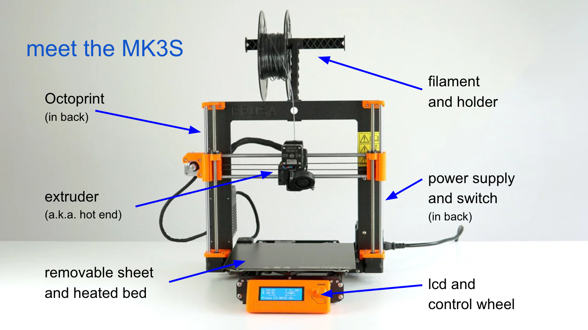

<!--
_class: intro-blue
-->

# &nbsp;
# Introduction to 3D Printing

### Presented by: Tommy Falgout

<!-- Google tag (gtag.js) -->

---

# Agenda

- What is 3D Printing?
- Realities of 3D Printing
- How does 3D Printing work?
- Real world scenarios
- My 3D Printer 
- Demo Time!

---

# Me

- Long-time Maker
- Ex-VP + Board Member of TheLab.ms (Local Makerspace)
- Builder and organizer of trebuchet events (even on IMDB!)
- Bought 3D Printer during COVID
 

---

# What is 3D printing?

- Additive manufacturing
  - Adds one layer on top of another (like layers of a cake)
  - Different from subtractive manufacturing like a CNC mill which removes parts
- "A glue gun, attached to a robot" - Einstein, probably

---
<!--
_footer: Copied with permission from [TheLab.ms training by Olivia Snyder](https://docs.google.com/presentation/d/1RpBGpOUf0rU5yu56ckui9OEuSXbKfjEDPiq_R-mkSMI/edit#slide=id.g263ebf6c00_0_0)
-->

---

# Types of 3D Printing

- What we're focuing on today
  - FDM - Fused Deposition Modeling
    - What most people think of regarding 3D Printing at home
    - Exemplifies the two A's of a new hobby:
      - _Affordable & Accessible_
- Cool stuff we're not focusing on
  - Stereolithography (SLA)
  - Digital Light Processing (DLP)
  - Selective Laser Sintering (SLS)
  - Selective Laser Melting (SLM)

---

# Hard Truths about 3D Printing

- It's not "Plug 'n' Play"
- It takes longer than you think
- Your prints will fail occasionally
- You can't 3D Print ALL THE THINGS

---

# Awesome Truths about 3D Printing

- You're only limited by your own brain and physics
- 3D printing is a gateway to other skills
- Create amazing things
- There's a large communities

---

# How to 3D Print

- Design - create a 3d model of the object
- Slice - turns design into instructions
- Print - tell the printer what to do

<!--
_footer: STL = Standard Triangle/Tessellation Language
-->
---

# Design - Download an object

- [Thingiverse](https://thingiverse.com)
- [Printables](https://www.printables.com/)
- [Thangs](https://www.thangs.com/)

---

# Design - Make yourself

- Tinkercad
- OpenSCAD
- Fusion 360
- Blender

---

# Slice - Create printer instructions

- Types of instructions
  - Print head temperature
  - Print bed temperature
  - How fast to print
  - Where should the print head be at any moment
- Apps
  - PrusaSlicer
  - Cura

---

# Print

- Can print more than one model at a time
- Options
  - Load from SD card
  - Use Print Manager - WebApp
    - OctoPrint - Installs on RaspberryPi
    - Prusa MK4 is built-in

---

# Result

---

# My printer

---

# Why I chose a Prusa

- Quality product
  - Costs more, but worth it
- Can buy as a kit and assemble yourself
  - RECOMMENDED to assemble.  It's fun, you learn a lot and if there's an issue, you know how to fix it
- GREAT instructions and community
- Many of my friends have them (bounce ideas/support)
- Most parts are 3D printed and [Open Sourced](https://www.printables.com/@Prusa3D/collections/54487)!
  - Inspired by [RepRap](http://reprap.org/)
- In some cases, you can skip the slicing step
 
---

<!--
_class: intro-blue
-->

# DEMO TIME!

---

# Demo

- Design - Tinkercad and/or OpenSCAD
- Slice - PrusaSlicer
- Print - OctoPrint

---

# Tip and Tricks

- Clean bed, happy print
  - Before print, wipe with 90%+ IPA (isopropyl alcohol)
- [OctoPi](https://octoprint.org/download/) - Manage your prints
- [Spaghetti Detective](https://www.obico.io/the-spaghetti-detective.html) - Monitor your prints

---

<!--
_class: intro-blue
-->

# Q & A

---

<!--
_class: intro-blue
-->

# Fin.  Et merci.
